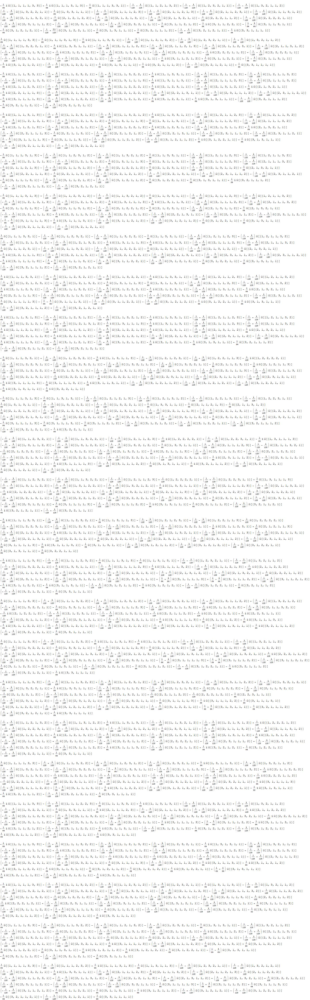

# Importing Data
There are two formats the sets of solutions are available in:

## Import .wdx format
You can import the wdx formatted solutions into Mathematica in the usual way.

## Import .txt format
To import the text formatted solutions into Mathematica use

```
sols = ToExpression@Import["flux-sols-rep_part-*.txt", "Lines"];
```

# List of Flux Solutions

